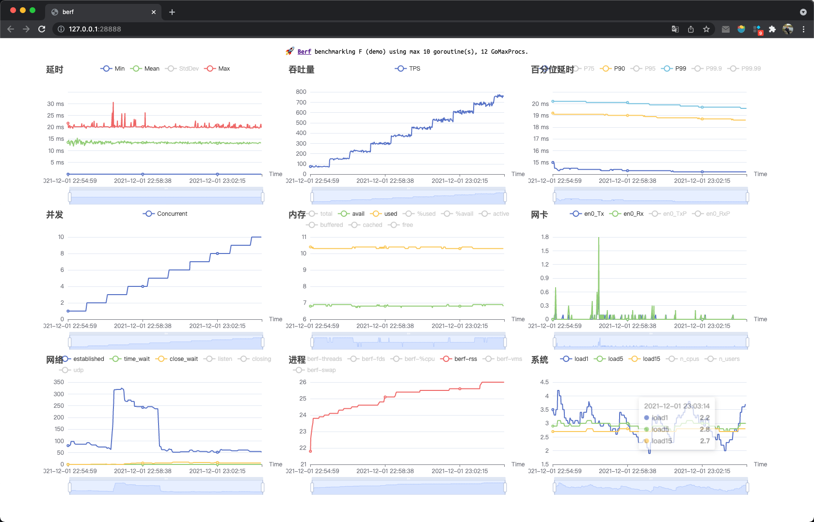

# perf

perf framework for local methods.

```sh
$ perf -f demo -v -ci 1 -c10
Benchmarking demo using max 10 goroutine(s), 12 GoMaxProcs.
@Real-time charts is on http://127.0.0.1:28888

Summary:
  Concurrent              0
  Elapsed          1m0.001s
  Count/RPS   24753 412.537
    200       22362 372.688
    500         2391 39.849

Statistics   Min     Mean    StdDev     Max
  Latency    1µs   13.328ms  5.154ms  31.093ms
  RPS       68.94   412.53   219.73    761.04

Latency Percentile:
  P50         P75       P90       P95       P99      P99.9     P99.99
  14.147ms  17.102ms  18.559ms  19.153ms  19.579ms  20.199ms  30.011ms

Latency Histogram:
  17µs      2159   8.72%  ■■■■■■■■■■■■■■■■■■■■
  9.789ms   2840  11.47%  ■■■■■■■■■■■■■■■■■■■■■■■■■■
  11.773ms  3839  15.51%  ■■■■■■■■■■■■■■■■■■■■■■■■■■■■■■■■■■■
  13.504ms  3965  16.02%  ■■■■■■■■■■■■■■■■■■■■■■■■■■■■■■■■■■■■
  15.073ms  3269  13.21%  ■■■■■■■■■■■■■■■■■■■■■■■■■■■■■■
  16.908ms  4279  17.29%  ■■■■■■■■■■■■■■■■■■■■■■■■■■■■■■■■■■■■■■■
  18.55ms   4347  17.56%  ■■■■■■■■■■■■■■■■■■■■■■■■■■■■■■■■■■■■■■■■
  19.462ms    55   0.22%  ■
```




## 部署

1. 上传 perf 到 `/usr/local/bin` 目录
2. 建一个 perf 目录，放入perf 程序: `mkdir perf; cd perf`
3. 在 perf 目录中创建 ctl 脚本: `perf -init`
4. `./ctl start -f nop` 启动硬件监控采点后台进程
5. 下载目录中最新的形如 `perf_202111301122.log.gz` 采点日志
6. 本地使用命令 `perf perf_202111301122.log.gz` 在浏览器中查看采点曲线，进行分析
7. 参数
   - `export PERF_TICK=1s` 每 1s 生成一个点，默认 5s 生成一个.
