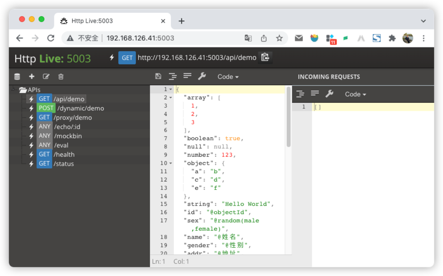

# 性能压测工具/框架 Berf 带你飞

轻快自由的压测工具 [Berf](https://github.com/bingoohuang/Berf)，用了就飞了，用了就爱了！

当我们谈到要做性能压测时，经常就需要选用一款合适顺手的工具来干活。最常见的是 Apache
Jmeter，有界面有大量的文档网络资料可以参考，所以很多人都第一印象想到它。但是我们咋又自己造轮子，要搞一个 Berf 呢，其中有 3 个最主要的原因：

1. Berf 非常轻量，可执行文件 10 M，扔到 Linux 服务器上就可以直接运行。Apache Jmeter 67 M，然后再搭配一个 Java 虚拟机 150 M，如果又在 VPN 网络中上传，那么 10M 对比 220M，1:
   22，Berf 完胜。
2. Berf 基于 Golang 的优异的用户级的 GPM 并发协程模型，Jmeter 只能在线程模型上运行。所以压到同样的 TPS 指标， Berf 对压测机的开销，远远小于 Jmeter。
3. Berf 还是一个压测框架，可以集成 Berf 压测框架，书写少量的代码，比如可以用来压测诸如签名的C SDK的性能指标。一个明显的例子是，Berf 版本压测能展现 2 万 TPS，而 SDK 提供的基于 pthread 的性能则只能
   1.8 万左右。
4. Berf 提供实时的 charts，实时显示压测指标，包括：延时、吞吐量、压测机负载、压测机网络、压测机内存等实时指标。因为最大 TPS 经常受限于内存网络等资源限制，从实时指标就可以观察到是不是接近资源限制了。
5. Berf 直接可以通过命令行，就可以快速启动，只需要 0.01 秒，Jmeter 需要先构建一个脚本，熟手等 Jmeter 脚本构建完大约需要 30 分钟，Berf 好几轮压测都可以跑完了。
6. Golang 亲和性。毋庸置疑，使用 Golang 开发的应用，使用 Berf 来进行压测，天生亲和。
7. Berf 是 golang 开源的压测工具，代码少，简单易懂，可以根据自身需要，不断打磨。测随机文件上传下载，测符合自己业务场景的数据库性能，测 Redis 自定义业务场景的读写性能，Berf 都可以支持的溜溜溜。Jmeter 你磨不转。

\#|比较项 | Berf      | Jmeter            | 胜出者
---|--|-----------|-------------------|---
1 |体量| 10 M      | 220M              | Berf
2 |模型| GPM       | Threads           | Berf
3 |扩展| 集成 Berf  | Java 代码           | Berf
4 |图表| 浏览器集成  | Jmeter GUI        | Berf
5 |命令行| 启动 少于 1 秒| jmx脚本 启动 大于 10 分钟 | Berf
6 |亲和性| go 亲和  | java 亲和           | N/A
7 |精细打磨 | 开发维护简单 | 找 Apache     | Berf

使用 JMeter 的同学，还要特别注意:

> 不要使用 GUI 模式！不要使用 GUI 模式！不要使用 GUI 模式！
> -- 参见Jmeter 启动后第一句话：Don't use GUI mode for load testing !, only for Test creation and Test debugging. For load testing, use NON GUI Mode.

## 上个手试试

1. 使用 [httplive](https://github.com/bingoohuang/httplive/releases/tag/v1.3.5) 启动一个模拟 http 服务: `./httplive`
   ，可以使用浏览器查看一下预定义的api: `/status`.
2. 使用 Berf 做一下简单测试，看是否能够调通，返回正常，我们可以放心压测了。
3. 使用 Berf 跑一分钟压测，看看性能指标如何，我们可以看到 TPS 在 6 万，平均延时在 1 ms.



```sh
root@bx-PC:~/bingoohuang# ./Berf :5003/status -n1
Log details to: ./blow_20220110172431_747461230.log
### 127.0.0.1:52428->127.0.0.1:5003 time: 2022-01-10T17:24:31.638055629+08:00 cost: 468.49µs
GET /status HTTP/1.1
User-Agent: blow
Host: 127.0.0.1:5003
Content-Type: plain/text; charset=utf-8
Accept: application/json
Accept-Encoding: gzip, deflate


HTTP/1.1 200 OK
Date: Mon, 10 Jan 2022 09:24:31 GMT
Content-Type: application/json; charset=utf-8
Content-Length: 15

{"Status":"OK"}
```

```sh
root@bx-PC:~/bingoohuang# ./Berf :5003/status -d1m -t 1000 -v
Berf benchmarking http://127.0.0.1:5003/status for 1m0s using 100 goroutine(s), 1000 GoMaxProcs.
@Real-time charts is on http://127.0.0.1:28888

Summary:
  Elapsed                1m0.001s
  Count/RPS     3597024 59948.761
    200         3597024 59948.761
  ReadWrite    66.183 78.175 Mbps
  Connections                 100

Statistics    Min      Mean    StdDev     Max
  Latency    83µs    1.631ms   2.066ms  44.814ms
  RPS       57704.5  59930.39  1176.69  62593.06

Latency Percentile:
  P50      P75      P90      P95      P99     P99.9     P99.99
  798µs  1.937ms  4.539ms  6.163ms  9.216ms  15.321ms  22.612ms

Latency Histogram:
  1.235ms   3151783  87.62%  ■■■■■■■■■■■■■■■■■■■■■■■■■■■■■■■■■■■■■■■■
  3.99ms     385949  10.73%  ■■■■■
  6.872ms     52723   1.47%  ■
  9.409ms      5099   0.14%
  13.174ms     1100   0.03%
  18.486ms      237   0.01%
  22.104ms      128   0.00%
  25.211ms        5   0.00%
```


## 为啥叫 Berf 呢？

1. 基于开源 [plow](https://github.com/six-ddc/plow)
2. 自由定制 bingoo plow, [blow](https://github.com/bingoohuang/blow)
3. 提取框架，改名 perf, 意思是 performance，后来发现与 linux 工具重名，又继续改名 [Berf](https://github.com/bingoohuang/Berf)
